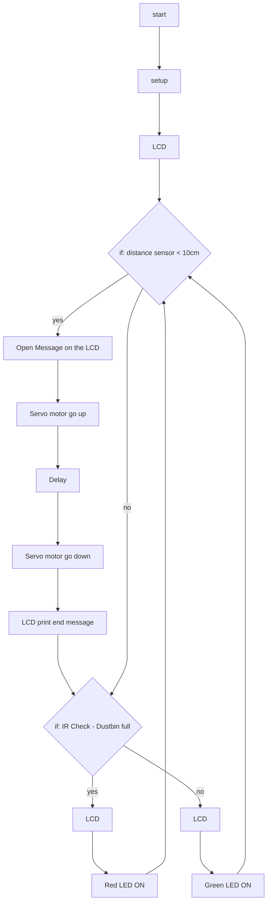

# SecureIOT

```mermaid
flowchart TD
start ---> setup
setup ---> LCD

  check_dist{if: distance sensor < 10cm}
LCD ---> check_dist
  id_open_message[Open Message on the LCD]
check_dist -- yes --> id_open_message
  id_90_deg_servo[Servo motor go up]
id_open_message ---> id_90_deg_servo
id_90_deg_servo ---> Delay
  id_0_deg_servo[Servo motor go down]
Delay ---> id_0_deg_servo
  id_end_message[LCD print end message]
id_0_deg_servo ---> id_end_message

  id_check_ir{if: IR Check - Dustbin full}
id_end_message ---> id_check_ir
  id_LCD[LCD]
id_check_ir -- yes --> id_LCD
  id_RLED[Red LED ON]
id_LCD ---> id_RLED
id_RLED ---> check_dist
  id_LCD2[LCD]
id_check_ir -- no --> id_LCD2
  id_GLED[Green LED ON]
id_LCD2 ---> id_GLED
id_GLED ---> check_dist
check_dist -- no --> id_check_ir
```
